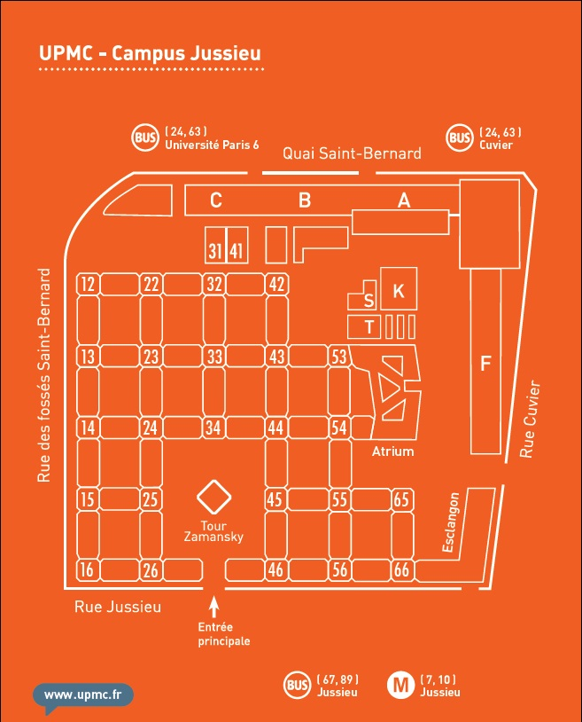
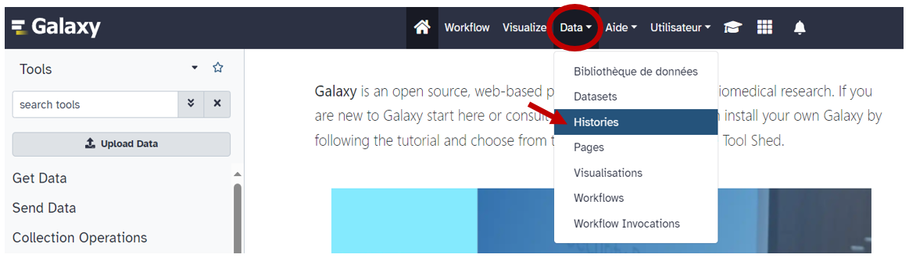
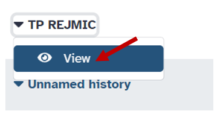
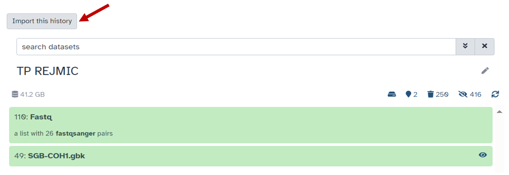
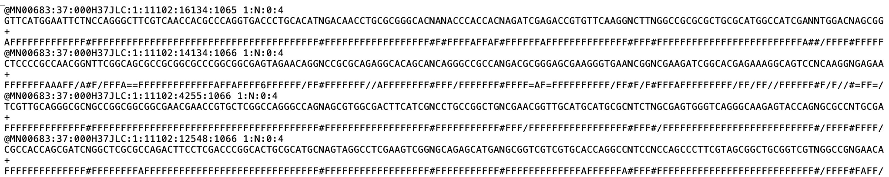

<<<<<<< HEAD
# Journée Bio-Informatique ReJMIC, EDITION N°4

---

**Le [ReJMIC](https://www.sfm-microbiologie.org/presentation-de-la-sfm/sections-et-groupes-de-travail/rejmic/) présente une journée d'inititation à la bioinformatique avec pour thématique : "Sciences Omiques : focus sur le génomique"**

## Informations pratiques:
- le 07/06/2024 (9h-17h)
- salle 102 (campus Jussieu)
- **campus de Jussieu** Université Pierre et Marie Curie (UPMC) : **4, place Jussieu 75005 PARIS**

**Accès :**
- en voiture (Parking souterrain gratuit : Entrée par la rue des Fossés Saint-Bernard, à hauteur de la tour 12)
- en métro : Ligne 7 ou 10 **station Jussieu**
- en bus : Ligne 67, 89 arrêt Jussieu ou lignes 24, 63 arrêt "Université Paris 6"

**Plan :**

  

## Intervenants :

**Dr Alexandre Godmer** (AHU département de bactériologie, site hôpital Saint-Antoine, Sorbonne-Université, INSERM, U1135, Centre d’Immunologie et des Maladies Infectieuses, [Cimi-Paris](https://cimiparis.fr/), Paris).

---
**Organisé par le ReJMIC :**

  

**Avec le soutien de Sorbonne Université :**

  

## Réalisation du TP :

### Pré-requis
- Création d'un compte sur [Galaxy](usegalaxy.org) 
- 

### Objectifs :
Identifier la présence d'une épidémie hospitalière à partir des données génomiques d’une trentaine de souches de *Streptococcus agalactiae* issues d’un séquenceur haut débit de type Illumina.

#### Etapes de l’analyse :
-	Récupération des fichiers de séquençage (format .fastq)
-	Vérification de la qualité des séquences
-	Alignement sur un génome de référence
-	Réalisation d’une matrice de SNP
-	Construction d’un arbre phylogénique 

## **1) Récupérer les données de séquençage des souches (fichiers fastq)**

•	Dans le bandeau bleu de Galaxy, cliquer sur l’onglet « Data », puis « Histories » et sélectionner « Public histories » et chercher « TP REJMIC » :

  

•	Lancer la recherche et cliquer sur « view » :

  

•	Puis cliquer sur « import this history » :

  

- L’historique comprend les fichiers de séquençage de 28 souches de streptocoques du groupe B (Streptococcus agalactiae) et un génome de référence au format GeneBank (gbk) qui correspond au format Fasta avec l’annotation du génome. 

- Le format **FASTQ (Q : Quality)** est un fichier texte contenant les données issues d’un séquençage. Chaque fichier contient les différentes séquences d’ADN, ou reads, associées à un score de qualité **(Q)** pour chaque nucléotide. Pour notre souche, deux fichiers R1 et R2 sont enregistrés sous ce format FASTQ. Ils correspondent aux mêmes fragments d’ADN, séquencés dans les deux sens. En effet, la technologie Illumina réalise du « *paired-end sequencing* », c’est-à-dire que les deux extrémités de chaque fragment d’ADN sont lues par le séquenceur.

  

- Les informations relatives à chaque séquence d’ADN sont organisées en 4 lignes :
  - @ + identifiant de séquence
  - Séquence nucléotidique du read
  -  "+"
  - Score de qualité associé à chaque base du read (relié à la probabilité d’erreur)

  

## **2) Créer une collection**

## **3)	Contrôler la qualité des séquences**

L’analyse de la qualité des séquences est une étape importante, réalisée grâce au logiciel FastQC (QC : Quality Control). Pour cela, il faut lancer une analyse FastQC.

NB : il est possible de réaliser un nettoyage des séquences, appelé « *trimming* » qui consiste à :
- Retirer les adaptateurs utilisés afin de fixer les séquences à la flowcell pour le séquençage
- Couper les extrémités des séquences de mauvaise qualité de lecture
- Filtrer les bases avec un mauvais score de qualité en les remplaçant par un « N » (signifiant que la base est indéterminée)
Un des logiciels de nettoyage de séquences les plus utilisés, disponible sur Galaxy, est *trimmomatic*.

**Attention :** Il est important de traiter de la même manière les fichiers R1 et R2

Pour vous aider à comprendre le rapport généré par l'application, vous trouverez le manuel en suivant ce [lien](docs/FastQC_Manual.pdf).
